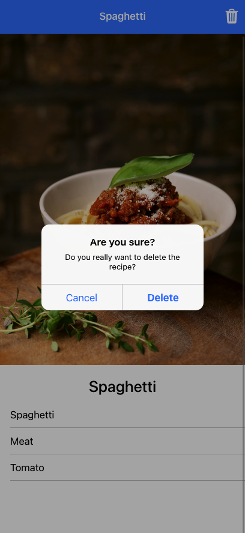

# ionicCourseAngular

Booking app, 1 to 1 rewritten from the [Ionic course](https://www.udemy.com/course/ionic-2-the-practical-guide-to-building-ios-android-apps/). Example of Ionic framework with the use of Angular framework.

 

    
 

